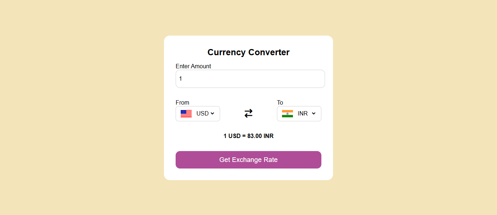

# Hi, I'm Harsh Mishra! 👋

## 🚀 I'm a full-stack developer...

## Project Title - 
### 🌍 Offline Currency Converter

An offline, responsive Currency Converter web app built using **HTML**, **CSS**, and **JavaScript** — with support for multiple currencies and country flags. No internet or API is needed to use this app!

## 🛠️ Features

- 💱 Convert between major world currencies
- 🚩 Displays country flags based on selected currency
- 📱 Fully responsive design
- ⚡ Works 100% offline – no API calls
- 🎯 Easy to extend with more currencies

## Average time to complete
#### 4 hrs

## 🛠️ Built With

## 🛠 Skills
HTML, CSS, JS

## Demo | Netlify
https://warm-druid-e3e04e.netlify.app/

## Screenshots

## 🌐 Supported Currencies
| Currency           | Code | Country Flag |
| ------------------ | ---- | ------------ |
| US Dollar          | USD  | 🇺🇸         |
| Indian Rupee       | INR  | 🇮🇳         |
| Euro               | EUR  | 🇪🇺         |
| British Pound      | GBP  | 🇬🇧         |
| Australian Dollar  | AUD  | 🇦🇺         |
| Canadian Dollar    | CAD  | 🇨🇦         |
| Japanese Yen       | JPY  | 🇯🇵         |
| Chinese Yuan       | CNY  | 🇨🇳         |
| Russian Ruble      | RUB  | 🇷🇺         |
| UAE Dirham         | AED  | 🇦🇪         |
| Singapore Dollar   | SGD  | 🇸🇬         |
| Swiss Franc        | CHF  | 🇨🇭         |
| Mexican Peso       | MXN  | 🇲🇽         |
| Brazilian Real     | BRL  | 🇧🇷         |
| South African Rand | ZAR  | 🇿🇦         |
| Bangladeshi Taka   | BDT  | 🇧🇩         |
| Pakistani Rupee    | PKR  | 🇵🇰         |

##📌 Notes
+ You can add more currencies by updating data.js with the exchange rate  and country code.

+ Flag icons are served from FlagsAPI. 

## 🤝 Contributing

Contributions are welcome! If you'd like to improve this project, feel free to submit a pull request or open an issue for discussion.

👨‍💻 Author
Harsh Mishra
📧 harshmishra0068@gmail.com
🌐 GitHub: HarshMishra23
